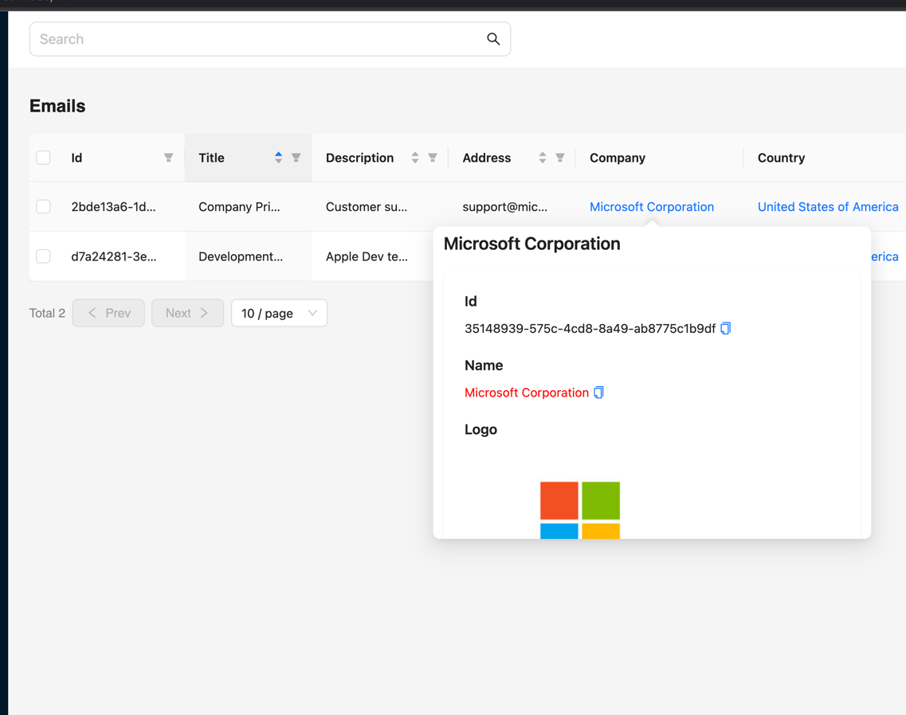

# entrefine
entrefine is a powerful tool that combines the power of two frameworks, [Ent](https://entgo.io/)(ORM) and [Refine](https://refine.dev/)(UI).


[](https://github.com/diazoxide/entrefine/issues)
[](https://github.com/diazoxide/entrefine/stargazers)


[](https://github.com/diazoxide/entrefine)


It simplifies the process of generating CRUDs from Ent definitions with customizable views, fields, actions and search features.


## Live Demo and Package Info
Live demo: https://demo.entrefine.dev/

Go.dev Package: https://pkg.go.dev/github.com/diazoxide/entrefine

## Features
1. Generates CRUD operations based on Ent definitions
2. Customizable views for each CRUD operation
3. Customizable fields for lists, forms, and show views using annotations
4. Custom actions for items
5. Relational view with nested lists and edges
6. Smart search component to find records by every attribute with a custom operator
7. Bulk actions on lists
8. Uses only a Graphql API with a custom Refine data-provider
9. Generates TypeScript types from Ent definitions
10. Column filters with customizable operators
11. [Edges diagram graph view](#edges-diagram-graph-view) (with [gojs](https://github.com/NorthwoodsSoftware/GoJS) or [react-force-graph](https://github.com/vasturiano/react-force-graph))

## Roadmap
- [ ] I18n support
- [ ] Keycloak Authentication
- [ ] Keycloak Authorization

### Smart search
entrefine provides a smart search component to easily find records by any attribute with a custom operator.


## Requirements
The platform uses a Graphql API as the data-provider interface and therefore a GQL extension is mandatory.

## How to set up?

### Extension registration on entc.go
Add extension to your Ent framework `entc.go` file.

#### Example

```go
package main
import (
	//...
	"entgo.io/contrib/entgql"
	"github.com/diazoxide/entrefine"
)

func main() {
	gqlEx, err := entgql.NewExtension(
		// Make sure that EntGql configs are wrapped
		EntRefine.EntgqlExtensionOptionsWrapper(
			entgql.WithConfigPath("./gqlgen.yml"),
			entgql.WithSchemaGenerator(),
			entgql.WithSchemaPath("./graphql/ent.graphql"),
			entgql.WithWhereInputs(true),
		)...,
	)
	//...
	opts := []entc.Option{
		entc.Extensions(
			// GQL extension is mandatory
			gqlEx,
			// EntRefine configuration
			EntRefine.NewExtension(
				EntRefine.WithAppPath(filepath.Join("..", "refine"),
			),
		),
	}
	err = entc.Generate(schemaPath, config, opts...)
	//...
}
```

### Then Apply search query to your query resolvers WhereInput

This is important for smart-search component

> `EntityWhereInput.ApplySearchQuery(q)`

#### Example
```go
package graphql

import (
	"ent"
	"context"
	"github.com/google/uuid"
)

func (r *queryResolver) Companies(
	ctx context.Context,
	after *ent.Cursor,
	first *int,
	before *ent.Cursor,
	last *int,
	orderBy *ent.CompanyOrder,
	where *ent.CompanyWhereInput,
	q *string, // Added by entrefine
) (*ent.CompanyConnection, error) {
	return r.client.Company.Query().Paginate(ctx, after, first, before, last,
		ent.WithCompanyOrder(orderBy),
		ent.WithCompanyFilter(
			where.ApplySearchQuery(q).Filter, // Applying query filter
		),
	)
}
```

### Configure your ent schemas with annotations

e.g. `EntRefine.FilterOperator("contains")`

## Supporting annotations

### For Fields
* ImageField
* MainImageField
* TitleField
* CodeField
* URLField
* RichTextField
* HideOnList
* HideOnShow
* HideOnForm
* FilterOperator `EntRefine.FilterOperator("contains")`
* [View](#custom-views)
* [ViewOnList](#custom-views)
* [ViewOnShow](#custom-views)
* [ViewOnForm](#custom-views)

### For Entities
  * Icon (field/entity) `EntRefine.Icon("some-antdesign-icon")`
  * [ListActions](#custom-list-actions-annotation) (entity)
  * NoList
  * NoShow
  * NoCreate
  * NoEdit
  * [View](#custom-views)
  * [ViewOnList](#custom-views)
  * [ViewOnShow](#custom-views)
  * [ViewOnForm](#custom-views)
  * [Badge](#badge-view)

## Getting ready to use

1. After configuration regenerate Ent.
2. Your package.json file is changed so run `npm install` to get deps.
3. Check directory of refine application. On src directory you can find `entrefine` folder with ent resources.
4. Update your `App.ts` file
    ```tsx
    import React from "react";
    import "@pankod/refine-antd/dist/reset.css";
    import {Refine} from "@pankod/refine-core";
    import {ErrorComponent, Layout, notificationProvider, ReadyPage,} from "@pankod/refine-antd";
    import routerProvider from "@pankod/refine-react-router-v6";
    import {GraphQLClient} from "graphql-request";
    import {Resources} from "./entrefine/resources";
    import dataProvider from "./entrefine/data-provider";
    
    // Provide your graphql query endpoint
    const client = new GraphQLClient("http://localhost:8081/query");
    
    function App() {
        return (
            <Refine
                routerProvider={routerProvider}
                dataProvider={dataProvider(client)}
                Layout={Layout}
                ReadyPage={ReadyPage}
                notificationProvider={notificationProvider}
                catchAll={<ErrorComponent/>}
                resources={Resources}
            />
        );
    }
    export default App;
    ```
5. Run `npm run dev`
6. Ready

## Search Component `<SearchComponent/>`

### How it works?

Querying all fields with your defined operator (**FilterOperator Annotation**) included UUID

### Example

#### Root App

```tsx
function App() {
    return (
        <Refine
            //...
            Header={Header}
            //...
        />
    );
}
```

#### Header component

```tsx
import {SearchComponent} from "../../entrefine/search-component";

export const Header: React.FC = () => {
    const screens = useBreakpoint();
    return (
        <AntdHeader style={{
            padding: "0 24px",
            background: "white",
        }}>
            <Row align="middle"
                 style={{
                     justifyContent: screens.sm ? "space-between" : "end",
                 }}>
                <Col xs={0} sm={12}>
                    <SearchComponent/>
                </Col>
            </Row>
        </AntdHeader>
    );
};
```

# Customization

## File `custom.tsx`

To customize entrefine components you can find `./entrefine/custom.tsx` file on your refine root directory.


## Custom List Actions Annotation

Add entity annotation to your schema

### Annotation Example
```
EntRefine.ListActions(
   EntRefine.ShowAction,
   EntRefine.DeleteAction,
   EntRefine.EditAction,
   EntRefine.Action{
       Name:  "Custom.MyPrettyButton",
       Attrs: map[string]any{},
   },
),
```

### Implementation Example

```tsx
// ./entrefine/custom.tsx
//...
export type MyPrettyButtonProps = ButtonProps &
    RefineButtonCommonProps &
    RefineButtonResourceProps &
    RefineButtonSingleProps &
    RefineButtonLinkingProps

export const MyPrettyButton: React.FC<MyPrettyButtonProps> = (props) => {
    return <Button
        icon={<RA.Icons.RadarChartOutlined/>}
        onClick={
            () => {
                alert(props.recordItemId)
            }
        }></Button>
}
//...
```

## Edges diagram graph view
The Edge Graph Diagram is an effective tool for visualizing 
the relationships between your entities. It presents an 
interactive representation of the edges, displaying record 
IDs and their connections to the main record, making it 
easier to understand and analyze complex data.


### How to enable

> **Important!**
> By default, the Edge Graph Diagram utilizes GoJS technology. 
Both GoJS and react-force-graph-2d are available options, 
allowing you to select the best solution for your needs. 
However, it's important to note that GoJS is a proprietary 
library and requires a license key purchased from the GoJS 
official website for commercial use. On the other hand, 
react-force-graph-2d is an open-source option.

### How to switch GoJS to react-force-graph-2d

Customize entrefine extension configs on **entc.go** file

e.g.
```go
entRefine, err := EntRefine.NewExtension(
    ...
    EntRefine.WithForceGraph2D(
        EntRefine.ForceGraph2DOptions{
            Enabled: true,
        },
    ),
    EntRefine.WithDefaultEdgesDiagram('Diagram.ForceGraph2D'),
    ...
)
```

### GoJS license and configuration

e.g.
```go
entRefine, err := EntRefine.NewExtension(
    ...
    EntRefine.WithGoJs(
        EntRefine.GoJSOptions{
            Enabled: true,
            LicenseKey: "xxxxx-xxxxxx-xxxxx-xxxxx",
        },
    ),
    EntRefine.WithDefaultEdgesDiagram('Diagram.GoJS'),
    ...
)
```

## Custom views

On entrefine every view of field is customizable for every type of layout.

### Special annotations
1. View - *Forcing list and show views*
2. ViewOnList
3. ViewOnShow
4. ViewOnForm

### How to customize?

1. First create new React Component on [custom.tsx](#file-customtsx) (e.g. `MyCustomTitle`) with `ViewProps` type props.
   ```tsx
   import {ViewProps} from "./view";
   
   export const MyCustomTitle: React.FC<ViewProps<string>> = ({value}) => {
      return <RA.Typography.Text copyable={true} style={ {color: "red"} }>{ value }</RA.Typography.Text>
   }
   ```
2. Define type of field on schema by `EntRefine.View` annotation
   ```go
   field.String("title").
        Annotations(
            ...
            EntRefine.View("MyCustomTitle"),
            ...
        ),
   ```
   
3. Regenerate and check
    
 
## Custom Badge view

### What is a badge?
Badge is a public view of entity on other items edge views.
e.g. 


### Badge customization
First you need to create new React component like [Custom Views](#custom-views). 
Then use `Badge` annotation to connect it with entity. 

## Example
Check out the documentation for more information and examples.

Both frameworks (Ent and Refine) are configured as described in documentation. 

## Contacts

**Linkedin**:  https://www.linkedin.com/in/aaron-yor/

**Discord**:   aaron․yordanyan#7556

**Phone**:     +374 98 471111